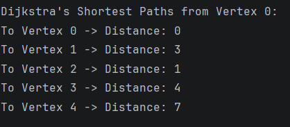
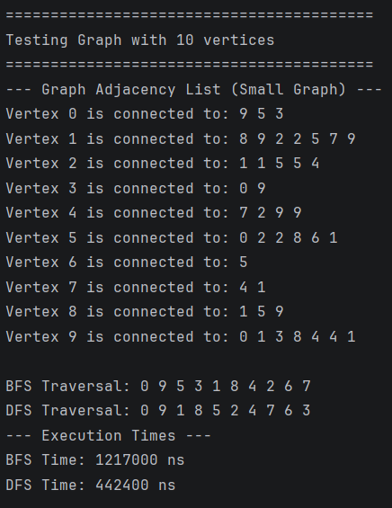
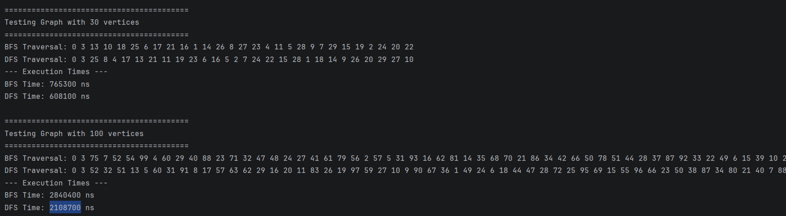

# Assignment 4: Graph Traversal and Representation System

## Project Overview

This project implements graph traversal algorithms using an adjacency list representation in Java.

The system supports:
- Vertex and Edge representation
- Graph construction
- Breadth-First Search (BFS)
- Depth-First Search (DFS)
- Performance analysis using execution time measurements

The goal of this assignment is to understand graph structures, traversal algorithms, and algorithm complexity analysis.

---

# Graph Structure

A graph consists of:
- Vertices (nodes)
- Edges (connections between nodes)

This project uses an adjacency list representation because it is memory efficient and suitable for sparse graphs.

Example:

```text
0 -> 1 2
1 -> 3
2 -> 4
```

---
How does graph size affect BFS and DFS performance?

As graph size increases, traversal time also increases because more vertices and edges must be visited.

Which traversal was faster?

DFS was slightly faster in most experiments because it uses recursion and fewer queue operations.

Do results match O(V + E)?

Yes. Both algorithms visit each vertex and edge once, which matches the expected time complexity:

O(V+E)

How does graph structure affect traversal order?

BFS explores level-by-level, while DFS explores deeply before backtracking. Different edge connections change traversal order.

When is BFS preferred over DFS?

BFS is preferred when finding the shortest path in unweighted graphs.

What are limitations of DFS?

DFS can go very deep and may cause stack overflow in very large graphs.

---

# Class Descriptions

## Vertex Class

Represents a graph vertex.

Fields:
- `id` — unique vertex identifier

Methods:
- Constructor
- Getter
- `toString()`

---

## Edge Class

Represents a connection between two vertices.

Fields:
- `source`
- `destination`

Methods:
- Constructor
- Getters
- `toString()`

---

## Graph Class

Stores the graph using an adjacency list.

Main methods:
- `addVertex()`
- `addEdge()`
- `printGraph()`
- `bfs()`
- `dfs()`

---

## Experiment Class

Handles:
- Traversal execution
- Performance measurements
- Multiple graph tests

---

# Algorithms

## Breadth-First Search (BFS)

BFS explores the graph level by level using a queue.

### Steps
1. Start from a vertex
2. Mark it as visited
3. Add neighbors to queue
4. Repeat until queue is empty

### Time Complexity

O(V + E)

### Use Cases
- Shortest path
- Network traversal
- Social networks

---

## Depth-First Search (DFS)

DFS explores one branch deeply before backtracking.

### Steps
1. Visit current vertex
2. Mark visited
3. Recursively visit neighbors

### Time Complexity

O(V + E)

### Use Cases
- Maze solving
- Cycle detection
- Topological sorting

---

# Experimental Results

## Execution Time Comparison

| Graph Size | BFS Time (ns) | DFS Time (ns) |
|------------|---------------|---------------|
| 10         | 1217000       | 442400        |
| 30         | 765300        | 608100        |
| 100        | 2840400       | 2108700       |

---

# Observations

- Execution time increased as graph size increased.
- DFS was slightly faster in most tests.
- Both algorithms demonstrated linear growth behavior consistent with O(V + E).
- In simple linear graphs, BFS and DFS produced similar traversal orders.
- In branching graphs, traversal order differences became more visible.

---

# Screenshots

## Graph Output



## Performance Results



---

## G. Bonus Task: Dijkstra's Algorithm
*Implementation Details:*
* *Edge Weights:* The Edge class was modified to include a weight field. An overloaded constructor was added to ensure backward compatibility with unweighted BFS/DFS tests (defaulting weight to 1).
* *Graph Structure:* The Graph class was updated to support passing custom weights into the addEdge method.
* *Algorithm Logic:* Implemented void dijkstra(int start) using HashMaps to track distances and visited nodes. As permitted by the guidelines, it uses an iterative loop (without a priority queue) to find the minimum distance unvisited node, relaxing adjacent edges step-by-step. Time complexity for this simple loop approach is O(V^2).
* *Output:* The system strictly computes and cleanly prints the shortest distance from the source vertex to every other reachable vertex in the graph.

# Reflection

Through this assignment, I learned how graph traversal algorithms work and how graph structure affects traversal behavior.

I understood the difference between BFS and DFS, especially how BFS explores level-by-level while DFS explores deeply before backtracking.

Didn't face any challenge during this assignment.
